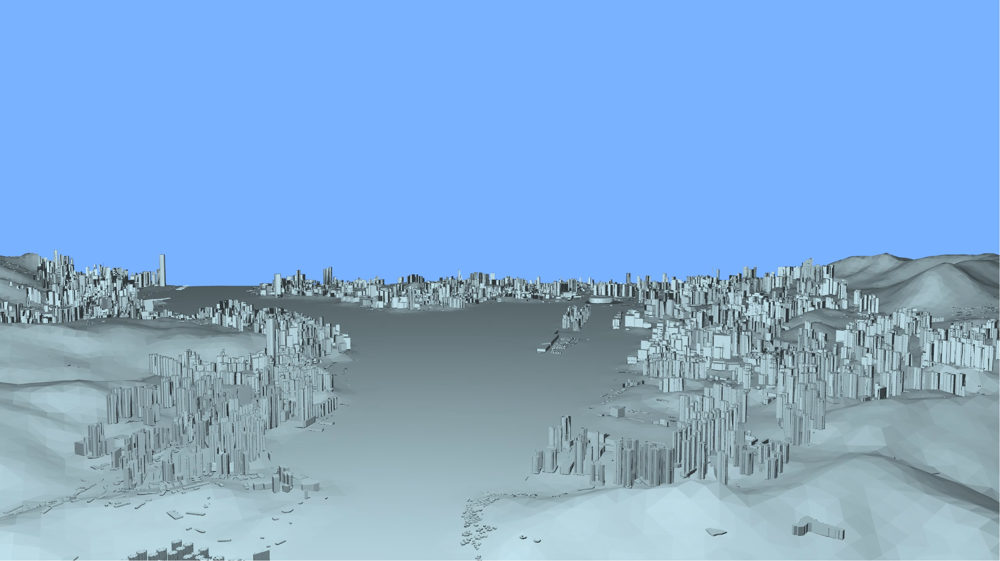
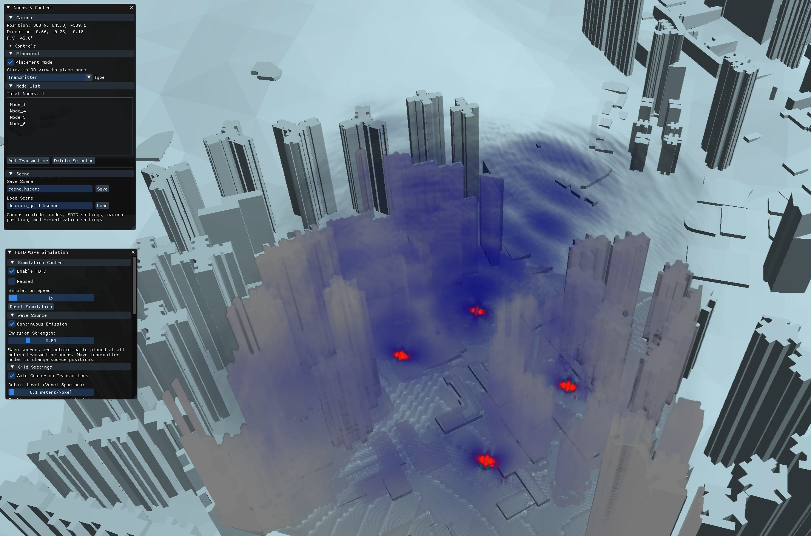
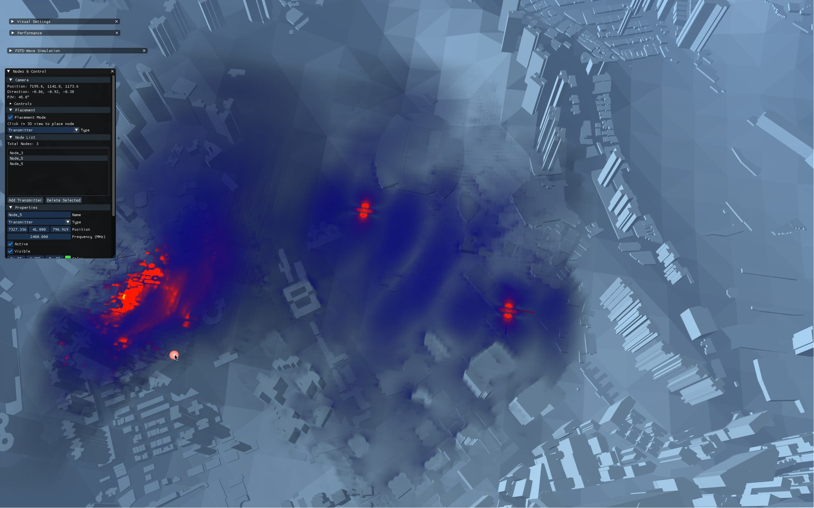

# wavelet

This project was created for Junction 2025.

We visualize EM (specifically on the radio spectrum) via the Maxwell equations which describe EM radiation in a specified grid, giving time-based mathematical wave-forms. This was done in Pure C++ / OpenGL with no other dependencies. Optimized for GPU rendering. We heavily abused compute shaders, parallelism, culling, and tons of graphics programming principles.

The result is quite a mesmerizing simulation of radio waves through any model, in this challenge's case a map of Hong Kong. These radio waves can interfere, be absorbed, and show hot-spots and points where not much signal reaches. Pretty much everything is customizable with our ImGui overlay, from the color of the wave-forms to the frequency of each transmitter node. We also implement clever optimization solutions such as a dynamic grid system which adapts to new transmitter nodes added to the system, allowing minimal performance impact unless absolutely necessary. We allow for various simulation controls such as speed, intensity, and detail handled by our compute shaders from the actual model. We also ended up creating many prototypes from shooting stars inside 3d cubes to heat-map slices

tl;dr: we use a ton of cool tech to make an insane physics visualization, along with a collection of cool prototypes

# submission

# images

These are screenshots of a live simulation. Our presentation video is also available above.

